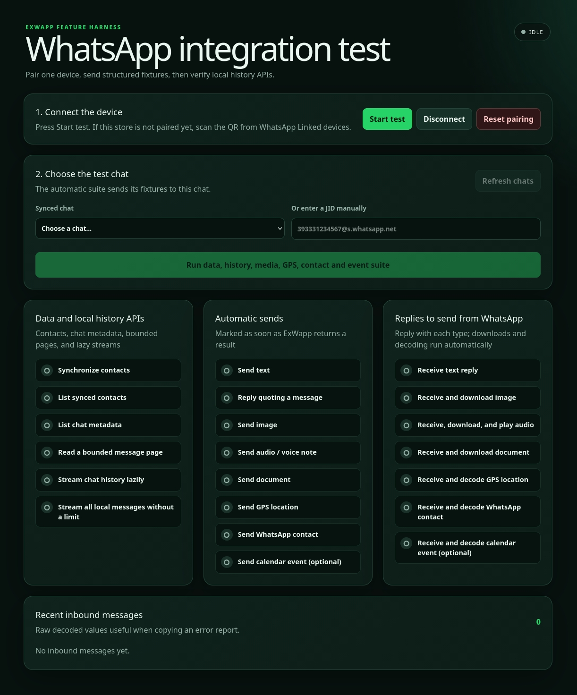

# demo_ex_wapp



Phoenix LiveView demo, integration guide, and interactive feature suite for
[ExWapp 0.1.2](https://hex.pm/packages/ex_wapp/0.1.2).

This repository shows how to create and persist an ExWapp session, pair a
WhatsApp linked device, send and receive every supported message type, inspect
local contacts and history, and surface the results in a LiveView dashboard.

> ExWapp is an unofficial WhatsApp Web client. Use a dedicated test account,
> avoid spam, and review the risks described in the
> [ExWapp documentation](https://hexdocs.pm/ex_wapp/0.1.2).

## Run the demo

Requirements:

- Elixir 1.19 with Erlang/OTP 28, or Elixir 1.20 with Erlang/OTP 29
- a WhatsApp account that can link a new device

```bash
git clone https://github.com/elchemista/demo_ex_wapp.git
cd demo_ex_wapp
mix setup
mix phx.server
```

Open [http://localhost:4000](http://localhost:4000). The dashboard is the
LiveView mounted at `GET /`; downloaded test media is served temporarily from
`GET /downloads/:token`.

### Interactive test flow

1. Click **Start test**.
2. If the store is not paired, scan the QR code from WhatsApp → Linked devices.
3. Wait for `connected`, then choose a synced chat or enter a complete JID such
   as `393331234567@s.whatsapp.net`.
4. Click **Run data, history, media, GPS, contact and event suite**.
5. Reply from WhatsApp with text, image, audio, document, location, contact,
   and optionally a calendar event to complete the inbound checks.

The dashboard covers:

| Area | Checks |
| --- | --- |
| Data and history | contact sync, contacts, chat metadata, bounded history, lazy history stream, complete local stream |
| Outbound | text, quoted reply, image, voice note, document, GPS, vCard contact, optional calendar event |
| Inbound | text, image download, audio download/playback, document download, GPS, contact, optional event |

The event test is optional because that WhatsApp Web message type is less
stable than text, media, location, and contacts. History functions inspect the
local ExWapp store; they do not request a complete remote account export.

## Add ExWapp to another application

```elixir
# mix.exs
defp deps do
  [
    {:ex_wapp, "~> 0.1.2"},
    {:jason, "~> 1.4"}
  ]
end
```

ExWapp requires the host application to select a JSON implementation:

```elixir
# config/config.exs
config :ex_wapp, :json_library, Jason
```

`Poison`, Elixir's built-in `JSON` module, or an adapter implementing
`ExWapp.JSON.Library` can be used instead.

## Create an ExWapp client

`%ExWapp.Client{}` is the supported public application API. Keep the updated
client returned by every mutating operation in a GenServer, LiveView, job, or
another process owned by your application.

```elixir
client =
  ExWapp.new(
    session_id: "account_1",
    store:
      {ExWapp.Store.Ets,
       path: "/var/lib/my_app/account_1.etf",
       max_messages_per_chat: 10_000},
    transport: ExWapp.Client.Transport.Session,
    events: MyApp.WhatsAppEvents,
    metadata: %{pair_timeout: 30_000}
  )

{:ok, client} = ExWapp.connect(client)
{:ok, client, pairing} = ExWapp.pair(client)

case pairing do
  {:code, qr_code} -> MyApp.QR.display(qr_code)
  :pending -> :ok
  :success -> :ok
end

{:ok, client, message_id} =
  ExWapp.send_message(client,
    to: "393XXXXXXXXX@s.whatsapp.net",
    text: "Hello from ExWapp"
  )

{:ok, chats} = ExWapp.list_chats(client)
{:ok, messages} = ExWapp.get_messages(client, "393XXXXXXXXX@s.whatsapp.net", limit: 50)
{:ok, client} = ExWapp.disconnect(client)
```

Use `ExWapp.Client.Transport.Session` for a complete production connection. It
provides the WebSocket, Noise handshake, Signal sessions, device fanout,
storage, retries, and synchronization required by WhatsApp Web.

### `ExWapp.new/1` options

| Option | Purpose | Typical value |
| --- | --- | --- |
| `:session_id` | Stable identifier for the account/session | `"account_1"` |
| `:store` | Store module, `{module, options}`, or an existing store struct | `{ExWapp.Store.Ets, path: "account_1.etf"}` |
| `:transport` | Runtime adapter; defaults to a no-op adapter | `ExWapp.Client.Transport.Session` |
| `:events` | High-level event adapter | `MyApp.WhatsAppEvents` or `ExWapp.Events.Telemetry` |
| `:runtime` | Per-client runtime overrides merged with global config | `%{iq: %{default_timeout_ms: 45_000}}` |
| `:metadata` | Application metadata and transport options | `%{pair_timeout: 30_000}` |
| `:client_version` / `:wa_version` | Protocol-version shorthand; normally leave unset | string, `{major, minor, patch}`, or version map |
| `:status` | Initial client state; normally leave the default `:new` | `:new` |

Do not override the WhatsApp client version unless the built-in value is known
to be obsolete. Authentication can succeed with an incompatible override while
later sync or prekey requests fail without an obvious error.

## Create a supervised ExWapp session

This demo uses the process-based session API internally because the dashboard
subscribes directly to QR, connection, and inbound-message events. The relevant
code is in `DemoExWapp.WhatsApp`.

```elixir
alias ExWapp.Session.Supervisor, as: SessionSupervisor

File.mkdir_p!("var/ex_wapp")

{:ok, session} =
  SessionSupervisor.start_session("account_1",
    store: {ExWapp.Store.Ets, path: "var/ex_wapp/account_1.etf"},
    auto_connect: false,
    reconnect: true
  )

qr_task =
  Task.async(fn ->
    ExWapp.qr_stream(session)
    |> Enum.each(fn
      {:code, qr_code} -> MyApp.QR.display(qr_code)
      :success -> IO.puts("Pairing completed")
      {:error, reason} -> IO.warn("Pairing failed: #{inspect(reason)}")
      _event -> :ok
    end)
  end)

:ok = ExWapp.connect(session)
{:ok, message_id} =
  ExWapp.send_message(session, "393XXXXXXXXX@s.whatsapp.net", "Hello")

{:ok, ^session} = SessionSupervisor.get_session("account_1")
:ok = ExWapp.disconnect(session)
:ok = SessionSupervisor.stop_session("account_1")

Task.shutdown(qr_task)
```

`ExWapp.Application` starts the session registry and dynamic supervisor when
the dependency application starts.

### `start_session/2` options

| Option | Purpose | Default |
| --- | --- | --- |
| `:store` | Persistence adapter or `{adapter, options}` | default ETS store |
| `:auto_connect` | Connect immediately after process startup | `false` |
| `:reconnect` | Enable reconnect behavior | `true` |
| `:runtime` | Per-session runtime overrides | `%{}` |
| `:transport` | Low-level session transport module | `ExWapp.Conn` |
| `:noise` | Noise-handshake options | `[]` |
| `:name` | Optional GenServer name | `nil` |

Session IDs may be any term, but stable strings such as a user ID, UUID, or
account ID are recommended. Never run two sessions against the same persistent
store file.

## Storage

```elixir
# Persistent ETS-backed store
store =
  {ExWapp.Store.Ets,
   path: "var/ex_wapp/account_1.etf",
   max_messages_per_chat: 10_000}

# Ephemeral store for tests
store = ExWapp.Store.Memory

# Preloaded in-memory store
store = {ExWapp.Store.Memory, initial_data: %{}}
```

`ExWapp.Store.Ets` persists pairing credentials, contacts, chats, Signal state,
device cache, and local message history. Protect this file like a credential.
The demo uses `EX_WAPP_STORE_PATH` and defaults to
`var/ex_wapp/default.etf`. **Reset pairing** stops the session and deletes the
store plus its backup.

A custom backend can implement the `ExWapp.Store` behaviour.

## Runtime configuration

Global runtime settings live under `config :ex_wapp, :runtime`. Pass only the
values you need to override; ExWapp deep-merges them with its defaults.

```elixir
# config/config.exs
config :ex_wapp, :runtime, %{
  reconnect: %{
    enabled: true,
    max_attempts: 12,
    initial_backoff_ms: 1_000,
    max_backoff_ms: 300_000
  },
  iq: %{
    default_timeout_ms: 30_000,
    usync_timeout_ms: 15_000,
    group_info_timeout_ms: 15_000
  },
  send: %{
    max_outgoing_retry_attempts: 2,
    confirm_timeout_ms: 6_000
  },
  throttle: %{
    enabled: true,
    global: %{messages_per_second: 8.0, burst: 16},
    per_jid: %{messages_per_minute: 20},
    on_limit: :delay
  },
  quota: %{
    enabled: true,
    per_session: %{daily_messages: 5_000},
    per_jid: %{daily_messages: 500},
    on_exceeded: :block
  },
  app_state: %{initial_sync_enabled: true},
  calls: %{max_records: 500}
}
```

Override the same shape for only one client or session:

```elixir
client =
  ExWapp.new(
    transport: ExWapp.Client.Transport.Session,
    runtime: %{iq: %{default_timeout_ms: 45_000}}
  )

{:ok, session} =
  ExWapp.Session.Supervisor.start_session("account_1",
    runtime: %{app_state: %{initial_sync_enabled: false}}
  )
```

Available runtime groups are:

| Group | Controls |
| --- | --- |
| `reconnect` | attempts, exponential backoff, jitter, invalid-session stop |
| `health` | health-check interval |
| `iq` | default, prekey, USync and group-info timeouts; pending limit |
| `send` | retries, session repair, confirmation and fallback behavior |
| `send_error_guard` | consecutive/rate error limits and guard action |
| `queue` | maximum size, drop policy, flush batch and interval |
| `throttle` | global, per-JID and per-group send rates |
| `quota` | daily per-session, per-JID and per-group quotas |
| `prekeys` | initial/refill counts, threshold, cooldown, ID allocator |
| `signal` | Signal session/cache lifetimes and reset behavior |
| `app_state` | initial app-state synchronization |
| `calls` | retained local call-record limit |
| `protocol` | mode, version, device properties, user agent and decoding strictness |
| `safety` | rate-signal limits, cooldown and forbidden-send handling |
| `compliance` | opt-in/out and high-risk fanout limits |
| `adaptive_governor` | send-rate degradation/recovery from runtime signals |
| `risk` | risk scoring, thresholds, decay and manual unblock |
| `canary` | periodic login/send health checks |
| `release_gates` | kill switch, rollback profile and feature flags |
| `auth_guard` | repair, re-auth and re-pair limits/cooldowns |
| `protocol_health` | bad-MAC, prekey-miss and session-mismatch thresholds |
| `hygiene` | concurrent-store and fingerprint protection |
| `enforcement` | diagnostic snapshots and retained event limits |

Inspect every supported nested key and its current default from the installed
version:

```elixir
ExWapp.Config.defaults()
|> IO.inspect(pretty: true, limit: :infinity)
```

Disabling initial app-state sync may leave contacts and chat metadata
incomplete. The demo intentionally keeps the ExWapp protocol, device identity,
timeouts, Signal lifetime, and sync defaults unchanged.

## Send messages

```elixir
jid = "393XXXXXXXXX@s.whatsapp.net"

{:ok, client, text_id} =
  ExWapp.send_message(client,
    to: jid,
    text: "Hello",
    mentions: ["393YYYYYYYYY@s.whatsapp.net"]
  )

{:ok, client, reply_id} =
  ExWapp.send_message(client,
    to: jid,
    text: "Quoted reply",
    quoted_id: text_id,
    quoted_participant: jid
  )

{:ok, client, image_id} =
  ExWapp.send_image(client, jid, {:path, "photo.jpg"},
    mimetype: "image/jpeg",
    caption: "A photo",
    view_once: false
  )

{:ok, client, audio_id} =
  ExWapp.send_audio(client, jid, {:path, "voice.ogg"},
    mimetype: "audio/ogg; codecs=opus",
    ptt: true,
    duration: 8
  )

{:ok, client, document_id} =
  ExWapp.send_document(client, jid, {:path, "contract.pdf"},
    mimetype: "application/pdf",
    file_name: "contract.pdf",
    caption: "Contract"
  )

{:ok, client, location_id} =
  ExWapp.send_location(client, jid, 45.464_211, 9.191_383,
    name: "Duomo di Milano",
    address: "Piazza del Duomo, Milano",
    comment: "Meeting point"
  )

vcard = ExWapp.Contact.vcard("Mario Rossi", "+393331234567")
{:ok, client, contact_id} =
  ExWapp.send_contact(client, jid, "Mario Rossi", vcard)

starts_at = DateTime.add(DateTime.utc_now(), 3_600, :second)
{:ok, client, event_id} =
  ExWapp.send_event(client, jid, "Demo appointment", starts_at,
    description: "Created with ExWapp",
    end_time: DateTime.add(starts_at, 3_600, :second),
    location: %{
      name: "Milano",
      latitude: 45.464_211,
      longitude: 9.191_383
    }
  )
```

Media sources may be `{:path, path}`, `{:bytes, binary}`, or an existing
`%ExWapp.Media.Upload{}`. Useful message options are:

| Message | Options |
| --- | --- |
| All/context | `:id`, `:metadata`, `:mentions`, `:quoted_id`, `:quoted_participant` |
| Image | `:mimetype`, `:caption`, `:height`, `:width`, `:jpeg_thumbnail`, `:view_once` |
| Audio | `:mimetype`, `:seconds`/`:duration`, `:ptt`, `:waveform`, `:view_once` |
| Document | `:mimetype`, `:title`, `:page_count`, `:file_name`, `:caption`, `:jpeg_thumbnail`, `:contact_vcard` |
| Location | `:name`, `:address`, `:url`, `:is_live`, `:accuracy`, `:speed`, `:bearing`, `:comment`, `:jpeg_thumbnail` |
| Contact | `:is_self_contact` |
| Event | `:description`, `:location`, `:join_link`, `:end_time`, `:extra_guests_allowed`, `:scheduled_call`, `:has_reminder`, `:reminder_offset_seconds`, `:canceled` |

A successful send means the encrypted stanza reached the socket. Delivery and
read confirmation arrive asynchronously.

## Contacts, chats, history, calls, and diagnostics

```elixir
{:ok, client} = ExWapp.sync_contacts(client)
{:ok, contacts} = ExWapp.list_contacts(client)
{:ok, contact} = ExWapp.get_contact(client, jid)

{:ok, chats} = ExWapp.list_chats(client)
{:ok, groups} = ExWapp.list_groups(client)
{:ok, chat} = ExWapp.get_chat(client, jid)

# Newest-first materialized page
{:ok, messages} = ExWapp.get_messages(client, jid, limit: 100, offset: 0)

# Lazy local streams
{:ok, stream} = ExWapp.stream_messages(client, jid, order: :oldest_first)
{:ok, all_local} = ExWapp.all_messages(client, jid)

{:ok, calls} = ExWapp.list_calls(client, status: :missed, limit: 20)

status = ExWapp.status(client)
last_error = ExWapp.last_error(client)
diagnostics = ExWapp.diagnostics(client)
```

Chat values hold metadata; messages are stored and queried separately. Call
records contain signaling metadata only—ExWapp does not implement VoIP audio,
video, or call answering.

## Receive high-level events

Configure an adapter implementing `ExWapp.Events`:

```elixir
defmodule MyApp.WhatsAppEvents do
  @behaviour ExWapp.Events

  @impl true
  def emit(_client, event) do
    Phoenix.PubSub.broadcast(MyApp.PubSub, "whatsapp", event)
  end
end
```

Then pass `events: MyApp.WhatsAppEvents` to `ExWapp.new/1`. Use
`ExWapp.Events.Telemetry` instead to forward high-level events to telemetry.

The demo's process wrapper also subscribes directly to session events so it can
update the dashboard, persist inbound history, download/decrypt media, and keep
temporary previews available for ten minutes.

## Demo environment variables

| Variable | Default | Purpose |
| --- | --- | --- |
| `EX_WAPP_STORE_PATH` | `var/ex_wapp/default.etf` | Pairing and session store path |
| `EX_WAPP_DEBUG` | `true` in development | Enable ExWapp debug logging |
| `DEMO_LOG_LEVEL` | `info` | `debug`, `info`, `warning`, or `error` |
| `PORT` | `4000` | Phoenix HTTP port |
| `PHX_SERVER` | unset | Start the endpoint in a release |
| `PHX_HOST` | `localhost` | Production public host |
| `SECRET_KEY_BASE` | required in production | Phoenix signing secret |

Example:

```bash
EX_WAPP_STORE_PATH=var/ex_wapp/test-account.etf \
EX_WAPP_DEBUG=1 \
PORT=4000 \
mix phx.server
```

Do not publish QR payloads, store files, media keys, or logs containing private
JIDs and message content.

## Automated tests

The repository contains 20 ExUnit tests for the dashboard route, QR rendering,
session state, lazy-history verification, and quoted-reply target selection:

```bash
mix precommit
```

`mix precommit` compiles with warnings treated as errors, formats the project,
and runs all tests. These tests do not contact WhatsApp. The interactive suite
at `/` is the end-to-end protocol and media test against a real linked device.

## Project map

- `lib/demo_ex_wapp_web/live/dashboard_live.ex` — LiveView UI and checklist
- `lib/demo_ex_wapp/whats_app.ex` — supervised ExWapp session wrapper
- `lib/demo_ex_wapp/test_suite.ex` — interactive outbound/data/history suite
- `lib/demo_ex_wapp/session_state.ex` — shared dashboard state
- `lib/demo_ex_wapp/download_store.ex` — temporary inbound-media downloads
- `priv/fixtures/` — image, audio, and document send fixtures
- `test/` — automated ExUnit suite

See the complete [ExWapp 0.1.2 HexDocs](https://hexdocs.pm/ex_wapp/0.1.2)
for module-level API details.
